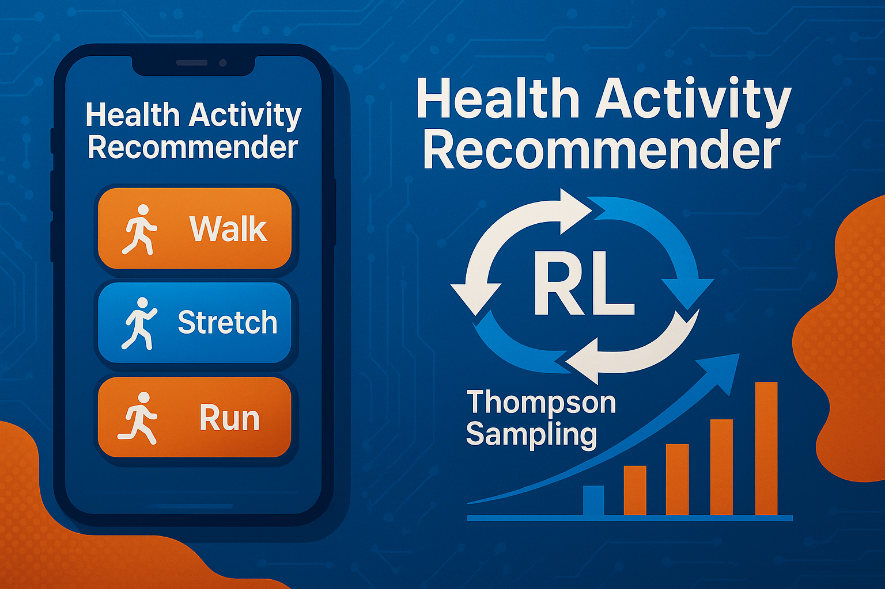
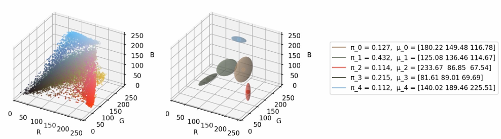
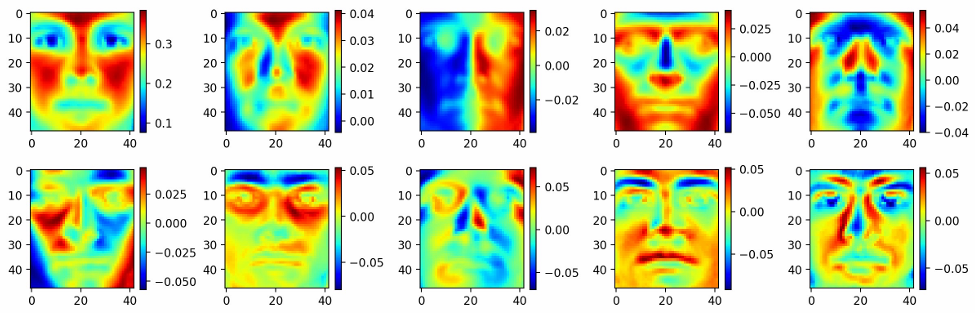

## 🎬 GUI-ASFormer: Transformer-Based GUI Video Segmentation
🔗 [GitHub Repo](https://github.com/oscar10408/GUI-ASFormer)   📄 [Project Paper (PDF)](/assets/GUI-ASFormer_Detecting_Keyframes_in_GUI_Videos.pdf)

**Description**  
This project applies transformer-based temporal models to detect fine-grained GUI interactions (clicks, scrolls, inputs) in screen recording videos.  
It extends the [ASFormer architecture](https://github.com/ChinaYi/ASFormer) and tailors it for GUI-specific use cases.

- Detects keyframes from minimal visual changes  
- Improves segment accuracy with post-refinement  
- Enables downstream use cases like GUI agent training and tutorial summarization

### 📈 Results Snapshot

---

## 🏃 Health Activity Recommender: Contextual Bandit for Personalized Wellness  
🔗 [GitHub Repo](https://github.com/oscar10408/Health-Activity-Recommender)

**Description**  
This project develops a personalized health activity recommender using reinforcement learning.  
By applying Thompson Sampling with contextual features, the system learns user preferences over time and adaptively suggests physical activities (e.g., walking, jogging) to boost engagement.

- Learns from user feedback and activity history  
- Applies contextual multi-armed bandit via Thompson Sampling  
- Boosts user step counts by 15–20% through tailored suggestions  
- Reduces inactivity by adaptively refining recommendations

---

## 🧬 Unsupervised Learning Core: K-Means, GMM, and CVAE Implementations  
🔗 [GitHub Repo](https://github.com/oscar10408/Unsupervised-Learning-Core-K-Means-GMM-and-CVAE-Implementations)

**Description**  
This project explores key unsupervised learning methods and demonstrates their implementation from scratch.  
It covers both clustering and generative modeling techniques, helping to visualize latent structures and simulate new data.

- Implements K-Means from first principles for intuitive cluster separation  
- Builds Gaussian Mixture Models using EM for soft assignment and probabilistic density  
- Constructs a Conditional Variational Autoencoder (CVAE) to learn latent representations and generate samples conditioned on labels  
- Visualizes clustering and latent space in 2D for real-world datasets (e.g. MNIST, synthetic blobs)

---

## 🔁 Transfer Learning: Vision & Language Modeling with Transformers  
🔗 [GitHub Repo](https://github.com/oscar10408/Transfer-Learning-Transformer-based-Language-Modeling)

**Description**  
This project demonstrates how transfer learning enhances performance in both computer vision and language modeling tasks.  
It includes fine-tuning a ResNet model for image classification and training a causal Transformer for GPT-style language generation.

- Fine-tunes ResNet with limited data for high-accuracy classification  
- Builds transformer decoder-only model for next-token prediction  
- Implements self-attention and causal masking from scratch  
- Supports task switching across CV and NLP domains

---

## 🖼️ CNN-RNN: Image Classification & Captioning from Scratch  
🔗 [GitHub Repo](https://github.com/oscar10408/CNN-for-Image-Classification-RNN-for-Image-Captioning)

**Description**  
This project implements both Convolutional Neural Networks (CNN) for image classification and Recurrent Neural Networks (RNN) for image captioning entirely from scratch using NumPy.  
It avoids using high-level frameworks like TensorFlow or PyTorch, providing a transparent view into the inner workings of deep learning models.

- Builds CNN and RNN architectures manually with NumPy  
- Applies CNNs for image classification tasks  
- Utilizes RNNs for generating descriptive captions for images  

---