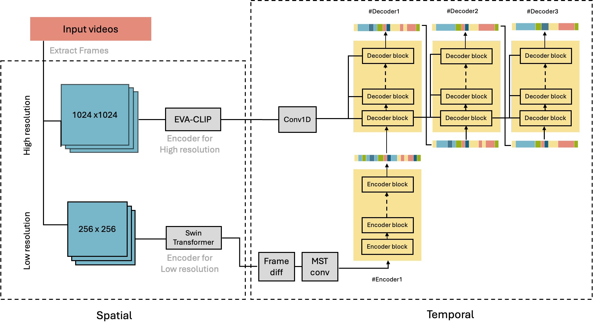
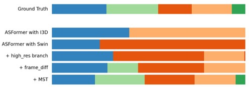

## 🧠 GUI-ASFormer: Transformer-Based GUI Video Segmentation

**Description**  
This project applies transformer-based temporal models to detect fine-grained GUI interactions (clicks, scrolls, inputs) in screen recording videos.  
It extends the [ASFormer architecture](https://github.com/ChinaYi/ASFormer) and tailors it for GUI-specific use cases.\\

- ⏱️ Detects keyframes from minimal visual changes  \\
- 🔍 Improves segment boundary accuracy with post-refinement  \\
- 📊 Enables downstream use cases like GUI agent training and tutorial summarization\\

🔗 [GitHub Repo](https://github.com/oscar10408/GUI-ASFormer)  \\
📄 [Project Paper (PDF)](/assets/files/GUI-ASFormer_Detecting_Keyframes_in_GUI_Videos.pdf)

### 📈 Results Snapshot

---

