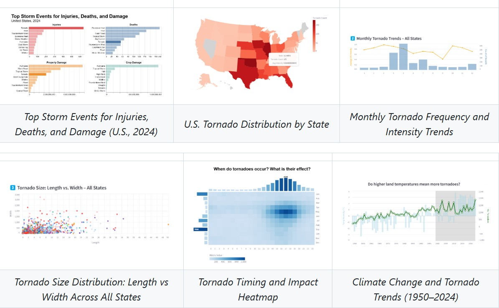
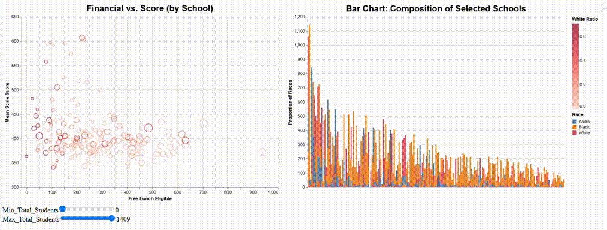

## 🌪️ Tornado Interactive Dashboard  
🔗 [GitHub Repo](https://github.com/oscar10408/tornado_interactive_dashboard)   🚀 [Live App](https://si649-narrative-project.streamlit.app/)

**Description**  
This interactive dashboard provides a comprehensive view of tornado activity across the United States using historical NOAA data.  
Users can explore patterns in tornado frequency, severity, and damage metrics through customizable visualizations.

-  Developed using **Altair** for rich interactivity and responsive layout  
-  Supports filtering by **state**, **year**, and **Fujita scale (EF0–EF5)**  
-  Visualizes **fatalities**, **injuries**, and **property/crop damage** through charts and heatmaps  
-  Enables analysis of **temporal trends** and **geospatial distribution**  

---

## 📊 Interactive Visualization of School Demographics and Performance 
🔗 [GitHub Repo](https://github.com/oscar10408/Dynamic-Data-Explorer/tree/main)  

**Description**  
This project explores the complex relationships among **school demographics**, **economic status**, and **academic performance** in New York State through rich, interactive Altair visualizations.  
By replacing static charts with responsive visual analytics, it allows users to investigate how factors like free lunch eligibility, race composition, school size, and gender distributions shape educational outcomes.

-  **Scatter + Bar Chart Combo**: Visualizes how **Financial Status** relates to **Score**, with linked **Race Composition** charts  
-  **Interactive Map + Gender Pyramid**: Explores **geographic patterns** and **gender structure** in school populations across NYC  
-  Supports **real-time filtering** by school size, racial majority, and white-student ratio  
-  Designed for educational researchers and policy analysts to gain intuitive insights from large public datasets  

---