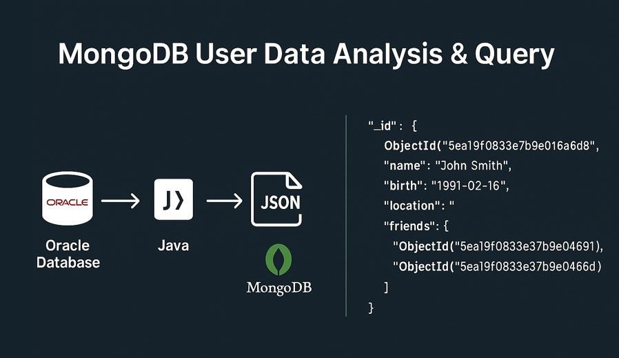

## 🗄️ Facebook-Style Relational Database Design  
🔗 [GitHub Repo](https://github.com/oscar10408/FaceBook-Database-Construction)

**Description**  
This project involves designing and implementing a relational database schema for a social media platform inspired by Facebook. It encompasses the creation of tables, enforcement of data integrity through constraints, and development of SQL scripts for schema creation and data management.

- Designed an ER diagram to model entities such as users, friendships, messages, photos, and events
- Implemented SQL scripts to create and manage database objects, ensuring referential integrity
- Developed views and queries to facilitate data retrieval and analysis
- Included scripts for loading sample data and dropping database objects for maintenance

---

## 🖧 Facebook-Style JDBC Database Interaction  
🔗 [GitHub Repo](https://github.com/oscar10408/facebook-JDBC)

**Description**  
This project demonstrates how to integrate Java applications with relational databases using **JDBC**. It focuses on executing SQL queries to retrieve and process data related to users, friendships, and events in a social network context.

- Implemented SQL queries to extract meaningful insights from the database
- Utilized **JDBC** for database connectivity and data manipulation
- Ensured proper resource management by closing connections and statements appropriately
- Organized code to separate concerns between data access and business logic

---

## 🗃️ MongoDB User Data Analysis & Query  
🔗 [GitHub Repo](https://github.com/oscar10408/MongoDB-User-Data-Analysis-and-Query)

**Description**  
This project demonstrates how to migrate relational data to a NoSQL system and perform analytical queries using **MongoDB**.  
It showcases data extraction from Oracle, transformation into JSON, and aggregation queries to reveal user and friendship patterns.

- Extracted user data from Oracle and transformed it into MongoDB-compatible JSON documents  
- Imported data into **MongoDB** and structured collections based on users, friendships, and cities  
- Performed queries to analyze friend counts, restore broken friendships, and extract birth month distributions  
- Applied MongoDB’s **aggregation framework** for efficient data grouping and statistical analysis  
- Demonstrates practical skills in **data migration**, **NoSQL modeling**, and **query design**  

---

## 📀 Grace Hash Join Implementation  
🔗 [GitHub Repo](https://github.com/oscar10408/Grace-Hash-Join-GHJ)

**Description**  
This project implements the **Grace Hash Join** algorithm to perform efficient joins on large datasets under memory constraints.  
It simulates disk I/O behavior, applies multi-pass partitioning, and builds memory-efficient hash tables to probe and merge matching records.

- Designed partition phase using a hash function to divide large relations into disk-based buckets  
- Developed probing phase with in-memory hash tables to join partitioned data efficiently  
- Handled recursive repartitioning when intermediate partitions exceed available buffers  
- Simulated buffer pool management and disk I/O to mimic realistic system limitations  
- Demonstrates practical understanding of **external join algorithms**, **buffer optimization**, and **query execution planning**

---
