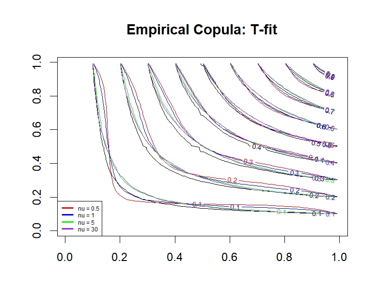

## 📊 Statistical Inference and Density Estimation
🔗 [GitHub Repo](https://github.com/oscar10408/Statistical-Inference-and-Density-Estimation) 

**Description**  
This project explores advanced statistical modeling techniques using R, focusing on point estimation, distribution fitting, and density estimation.  
It integrates both frequentist inference and simulation-based techniques applied to synthetic and financial return data.

-  Estimates t-distribution parameters based on kurtosis for modeling fat tails  
-  Uses Method of Moments to fit Gaussian Mixture Models  
-  Applies Kernel Density Estimation (KDE) and minimizes Integrated Squared Error (ISE)  
-  Simulates S&P 500 returns and constructs confidence intervals for financial analysis  
-  Analyzes how estimation methods respond to bandwidth and distributional assumptions

---

## 📉 Extreme Value Theory for Financial Risk Estimation  
🔗 [GitHub Repo](https://github.com/oscar10408/Extreme-Value-Theory-and-Risk-Estimation)

**Description**  
This project applies Extreme Value Theory (EVT) to estimate tail risks in financial markets, focusing on modeling rare but impactful events such as market crashes.  
By analyzing the extreme tails of return distributions, it provides more accurate estimations of Value at Risk (VaR) and Expected Shortfall (ES) compared to traditional methods.

-  Utilizes the Peaks Over Threshold (POT) method with the Generalized Pareto Distribution (GPD) for tail modeling  
-  Implements Maximum Likelihood Estimation (MLE) for parameter fitting  
-  Compares EVT-based VaR and ES estimates with those from historical simulation and normal distribution assumptions  
-  Includes backtesting procedures to validate the accuracy of risk estimates

---

## 📈 Robust Dependence Modeling and Copula Simulation  
🔗 [GitHub Repo](https://github.com/oscar10408/Robust-Dependence-Modeling-and-Copula-Simulation)

**Description**  
This project explores the use of copula functions to model complex dependence structures between financial assets. By separating marginal distributions from their joint dependence, copulas allow for more flexible and accurate modeling of asset correlations, especially in the tails of the distribution.

- Implements various copula families, including Gaussian, T, Clayton, and Gumbel  
- Simulates joint distributions with specified marginal behaviors  
- Analyzes tail dependencies and their impact on portfolio risk  
- Provides tools for visualizing and comparing different copula models

---

## 💹 Multivariate Risk Modeling and Portfolio Optimization  
🔗 [GitHub Repo](https://github.com/oscar10408/Multivariate-Risk-Modeling-and-Portfolio-Optimization)

**Description**  
This project focuses on robust risk modeling and strategic asset allocation through multivariate statistical techniques.  
By combining concepts from modern portfolio theory (MPT), copula-based dependence structures, and capital market models, the goal is to build efficient, well-diversified portfolios under realistic risk assumptions.

- Models asset co-movements using multivariate statistics and copulas to capture nonlinear and tail dependencies  
- Constructs the **Efficient Frontier**, identifying optimal portfolios that maximize return for a given level of risk  
- Evaluates **Value at Risk (VaR)** and **Expected Shortfall (ES)** to measure tail risks  
- Integrates **CAPM** to assess expected returns relative to systematic market risk (beta)  
- Visualizes capital allocation lines (CAL) and optimal portfolio mixes under risk-return tradeoffs
